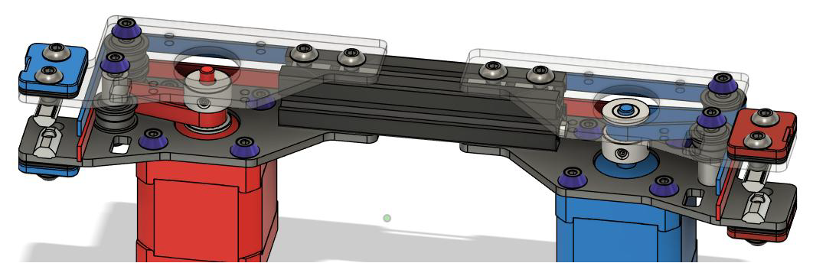

# Montage des supports moteurs

## Montage du support gauche
- Fixer le moteur sur la plaque du dessous avec 4 vis M3x08 et des rondelles  
- Fixer les entretoises diamètre 5mm, longueur 20mm avec des vis M3x10mm  
- Déposer deux ensembles à gauche (rondelle de précision M5x8x1mm, roulement F695, roulement F695 - rondelle de précision M5x8x1mm) et un à droite + un spacer 10mm   
- Fixer la plaque du haut avec deux vis M3x10mm  
## Montage du support droit
- Monter le support comme le précédent en inversant les deux piles de roulements  
# Montage des supports XY 
## Montage du support gauche
- Fixer les entretoises sur la plaque du bas  
- Déposer le bloc imprimé et les roulements  
- Visser la plaque du haut  
## Montage du support droit
- Monter le support comme le précèdent en ajustant la position des roulements comme affiché ci-dessous
# Montage des supports poulies avant
## Montage du support gauche
- Préparer les pièces verticales, casser légèrement les angles (en rouge) et tarauder en M3 la grande pièce verticale au centre (en vert)  
- Fixer l’entretoise avec une vis M3x10mm puis mettre les roulements puis le séparateur 10mm  
- Enfoncer le premier tensionneur dans la partie imprimée et ajouter le second tensionneur avec une vis M3x12 (Il faudra enlever complètement cette vis lors de la mise en place des courroies pour maximiser le déplacement de la poulie)  
- Fixer la plaque supérieure avec une vis M3x10  
- Fixer les supports de courroies Z avec des tnuts et vis M5x12 ou M5x14  
## Montage du support droit
- Monter le support comme le précèdent en inversant le bloc roulement et le séparateur
